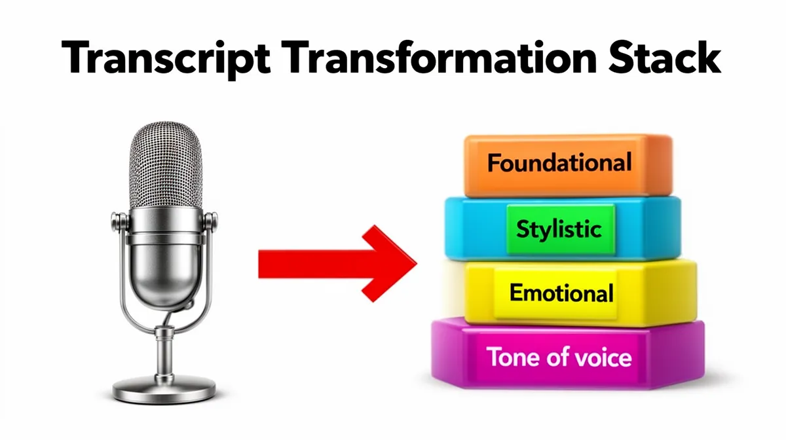
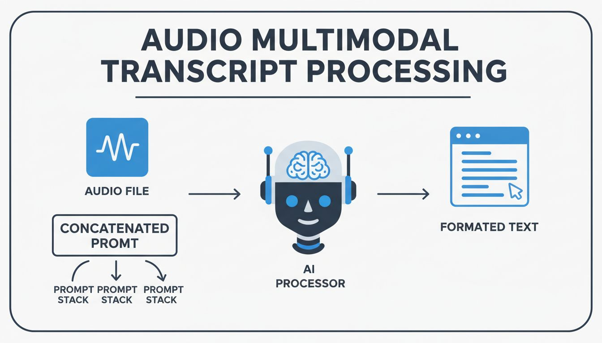

# Text Transformation Prompt Stack

A modular system for constructing LLM prompts that transform raw audio transcriptions into polished, formatted text. Designed for **audio multimodal models** (e.g., Gemini series) that perform single-pass dictation processing—receiving audio directly and producing edited text that goes far beyond verbatim transcription.

## The Core Innovation

Traditional speech-to-text produces verbatim transcripts. Users must then manually edit out filler words, false starts, self-corrections, background interruptions, and add punctuation. This stack leverages multimodal LLMs to perform **intelligent transcription editing in a single pass**, producing text that reflects what the speaker *meant* to say, not merely what they said.



## Two-Stack Architecture

The system uses a **two-stack architecture** that separates universally desirable cleanup from context-specific formatting:

### Foundational Stack (Always Applied)

The foundational stack contains editing instructions that are **universally desirable** for virtually all transcription use cases. These represent corrections that no reasonable user would want to see in their final text.

Located in `layers/foundational/`, these layers are applied in order:

| Order | Folder | Purpose |
|-------|--------|---------|
| 01 | `01-context/` | Establishes the transcription task and model role |
| 02 | `02-exclusions/` | Content to exclude (background audio, filler words, repetitions) |
| 03 | `03-corrections/` | Fixes to apply (meta-instructions, spelling, grammar, punctuation) |
| 04 | `04-inference/` | Smart format detection |
| 05 | `05-personalization/` | User-specific details for templates |

**The foundational premise:** There exists a baseline level of text cleanup that is almost always desirable. Outside of narrow use cases like court transcription, no user benefits from seeing "umm" written out or reading the same idea expressed three different ways.

### Stylistic Stack (Context-Specific)

Built on top of the foundational stack, stylistic layers customize output for specific purposes:

Located in `layers/stylistic/`:

| Category | Purpose | Selection |
|----------|---------|-----------|
| `format-adherence/` | Output structure (email, docs, lists) | Select one |
| `tone/` | Formality level | Select one |
| `emotional/` | Emotional register | Select one |
| `writing-style/` | Style modifiers | Select one or more |
| `readability/` | Complexity level | Select one |


## Structured Layer Definition

The complete transformation stack is defined in [`layers.json`](layers.json), which provides a machine-readable definition of all layers:

```json
{
  "meta": {
    "version": "2.0.0",
    "architecture": {
      "foundational": "Universal baseline corrections applied to all transcriptions",
      "stylistic": "Context-specific formatting and style adjustments"
    }
  },
  "foundational": {
    "layers": [
      {
        "order": 1,
        "folder": "01-context",
        "name": "Context",
        "elements": [...]
      }
    ]
  },
  "stylistic": {
    "layers": [...]
  }
}
```

This structured representation enables programmatic access, querying, and extension of the transformation stack.

## Example Stacks

### Business Email
Professional business email with appropriate formality and concise style.
```bash
./concatenate.py business-email.yaml
```

### Formal Email
Highly formal email for official or ceremonial correspondence.
```bash
./concatenate.py formal-email.yaml
```

### Casual Note
Friendly, informal text for personal communications.
```bash
./concatenate.py casual-note.yaml
```

### Technical Documentation
Technical documentation with precise terminology and advanced readability.
```bash
./concatenate.py technical-documentation.yaml
```

### Quick To-Do
Simple, actionable to-do list from voice notes.
```bash
./concatenate.py quick-todo.yaml
```

## Creating Custom Stacks

Create your own stack configurations by creating a YAML file in the `stacks/` directory:

```yaml
name: My Custom Stack
description: Description of what this stack does
layers:
  # Foundational layers (always include)
  - layers/foundational/01-context/task-definition.md
  - layers/foundational/02-exclusions/background-audio.md
  - layers/foundational/02-exclusions/filler-words.md
  - layers/foundational/02-exclusions/repetitions.md
  - layers/foundational/03-corrections/meta-instructions.md
  - layers/foundational/03-corrections/spelling-clarifications.md
  - layers/foundational/03-corrections/grammar-and-typos.md
  - layers/foundational/03-corrections/punctuation.md
  - layers/foundational/04-inference/format-detection.md
  - layers/foundational/05-personalization/user-details.md

  # Stylistic layers (select as needed)
  - layers/stylistic/format-adherence/email.md
  - layers/stylistic/tone/business-appropriate.md
  - layers/stylistic/emotional/neutral-emotion.md
  - layers/stylistic/writing-style/concise.md
  - layers/stylistic/readability/intermediate.md
```

### Stack Design Guidelines

1. **Always include foundational layers**: The entire `layers/foundational/` stack should be included
2. **Choose one format**: Select exactly one file from `format-adherence/`
3. **Choose one tone**: Select exactly one file from `tone/`
4. **Choose one emotional register**: Select exactly one file from `emotional/`
5. **Add style modifiers as needed**: Include any relevant files from `writing-style/`
6. **Choose one readability level**: Select exactly one file from `readability/`

## Programmatic Usage

```python
from concatenate import PromptStackConcatenator

# Initialize
concatenator = PromptStackConcatenator()

# List available stacks
stacks = concatenator.list_available_stacks()

# Generate a prompt
prompt = concatenator.concatenate_from_file("business-email.yaml")

# Use the prompt with your LLM
# ... your LLM integration code here ...
```

## Use Cases

- **Email composition** from voice notes
- **Meeting notes** transformation into structured documents
- **Technical documentation** generation from verbal explanations
- **Task extraction** from brainstorming sessions
- **Content creation** with consistent style and formatting

## Typical Workflow

1. **Record voice note** or provide audio file
2. **Select appropriate stack** for your desired output format
3. **Generate concatenated prompt** using this tool
4. **Submit to audio multimodal LLM** with your audio file
5. **Receive formatted output** according to your stack specifications

## Author

Daniel Rosehill
